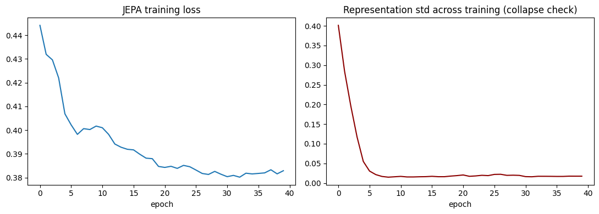

# Interpretability-Flavored JEPA on CIFAR-10

A small I-JEPA (Image Joint-Embedding Predictive Architecture) implementation
trained from scratch, followed by a mechanistic interpretability analysis of
the learned representations — in the same style as the Qwen3 attention/SAE
project already on the CV. Includes a diagnosed representation-collapse
failure mode and a VICReg-style regularization fix, with before/after results
across four independent metrics.

## Why this project (in one line)
Most "I implemented JEPA" projects stop at training loss going down. This
goes one step further: it asks what the representations actually look like —
whether they collapse, where semantic information concentrates by depth, and
whether they decompose into sparse, interpretable features — directly
overlapping FUNDIS's listed topics of Representation Learning, Explainable
AI, and Information Bottleneck Theory.

---

## Results summary

### Training: baseline vs. regularized

| Metric | Baseline (no reg) | Regularized (VICReg-style) | Change |
|---|---|---|---|
| Final `repr_std` | 0.0175 | **0.9749** | **55.5x** |
| Final prediction loss | 0.383 | 0.464 | higher (expected — see note below) |

.png>)

**Note on the loss increase:** prediction loss going *up* after regularization
is expected, not a regression. The baseline was taking a shortcut — predicting
a near-constant vector — which is trivially easy and produces artificially
low loss. Once collapse is prevented, the model has to solve the actual
prediction task, which is harder and reflected honestly in a higher loss.
`repr_std`, effective rank, probe accuracy, and SAE health are the metrics
that show whether the representations are actually useful — and by all four,
the regularized model is far better.

### Effective rank by layer (out of 128 possible)

Baseline: ranges ~3–7 across all layers (representations use only ~2–5% of
available capacity), with no consistent build-up across depth.

.png>)

Regularized:

| Layer | 1 | 2 | 3 | 4 | 5 | 6 |
|---|---|---|---|---|---|---|
| Effective rank | 14.1 | 39.7 | 62.7 | 69.5 | 83.0 | 115.4 |

.png>)

Rank now climbs steadily with depth, reaching 90% of full capacity by the
final layer — the encoder is building up richer structure layer by layer
instead of staying flat and collapsed everywhere.

### Attention entropy by layer

Baseline:

.png>)

Regularized:

| Layer | 1 | 2 | 3 | 4 | 5 | 6 |
|---|---|---|---|---|---|---|
| Entropy (nats) | 1.29 | 1.32 | 0.59 | **2.00** | 0.34 | 0.26 |

.png>)

Non-monotonic in the regularized model, with a sharp spike at layer 4 —
notably the same layer where linear probe accuracy peaks (see below).
Reported as an observation, not a firm conclusion; worth investigating further
if there's time, but not something to force a clean narrative onto.

### Linear probe accuracy by layer (frozen target encoder, CIFAR-10)

Baseline: peaked at layer 1 (~24.9%) and *decreased* with depth to ~20.4% —
backwards from what healthy self-supervised encoders typically show.

.png>)

Regularized:

| Layer | 1 | 2 | 3 | 4 | 5 | 6 |
|---|---|---|---|---|---|---|
| Test accuracy | 35.1% | 36.2% | 37.0% | **38.65%** | 37.3% | 33.0% |

.png>)

Peak now sits at a middle layer (layer 4) rather than the input layer, and
best accuracy improved significantly (24.9% → 38.65%) — consistent with the pattern
reported in the published I-JEPA/MAE literature, where semantic information
concentrates mid-to-late rather than at the very first layer.

### Sparse Autoencoder analysis

| | Baseline | Regularized |
|---|---|---|
| Dead feature fraction | 93.4% | **15.2%** |
| SAE reconstruction loss | 0.0002 (suspiciously trivial) | 0.099 (genuine reconstruction task) |

Baseline SAE — nearly all features dead, two-spike histogram:

.png>)

Regularized SAE — healthy firing distribution:

.png>)

Early vs. late layer comparison (regularized model):

| | Layer 2 (early) | Layer 6 (late) |
|---|---|---|
| Dead feature fraction | 81.1% | **15.2%** |
| Reconstruction loss | 0.0116 | 0.0986 |

A real dense→richer gradient with depth is now visible — in the collapsed
baseline, early and late layers were indistinguishable (both 93.4% dead,
since there was nothing to differentiate).

---

## What's implemented

**`model/jepa.py`**
- `ViTEncoder`: small pre-norm transformer (patch embed + sin-cos position
  embeddings + transformer blocks), used for both context and target encoders
- `Predictor`: narrow transformer that predicts target-encoder representations
  at masked positions from context-encoder representations + positional mask
  tokens
- `block_mask`: I-JEPA-style block masking (multiple target blocks, one large
  context region, no overlap)
- `variance_loss` / `covariance_loss`: VICReg-style anti-collapse
  regularization terms, applied to the context encoder's pooled
  representations. Disabled by default (weight=0) so base behavior is
  unchanged unless explicitly turned on.
- `JEPA`: wraps everything — EMA target encoder update, stop-gradient, loss

**`analysis/probe.py`**
- `effective_rank`: entropy-of-eigenspectrum measure of how many independent
  directions the representations actually use (a soft collapse detector)
- `attention_entropy_per_layer`: same metric as the Qwen3 project, applied
  here to the JEPA target encoder
- `train_linear_probe`: per-layer frozen linear probe on CIFAR-10 labels

**`analysis/sae.py`**
- `TopKSAE`: top-k sparse autoencoder (same recipe as modern LLM
  interpretability SAEs), trained per-layer on target-encoder representations
- `feature_sparsity_stats`: per-feature firing frequency, to identify dead
  features and compare sparsity patterns across layers

**`train.py`** — CLI training script with a live collapse-metric warning.

**`analyze.py`** — runs all four interpretability lenses on a trained
checkpoint and saves plots + `results.json`.

**`jepa_interpretability_kaggle.ipynb`** — the notebook that was actually
run to produce the results above. Self-contained: writes the module files,
trains the baseline, trains the VICReg-regularized comparison, runs all
analysis, saves plots.

## How to reproduce

1. Upload `jepa_interpretability_kaggle.ipynb` to Kaggle (or Colab), GPU
   runtime (T4 is enough).
2. Run all cells top to bottom. Baseline training (~20-30 min on a T4),
   regularized comparison training (another ~20-30 min), analysis (~10-15
   min, mostly the per-layer linear probes).
3. All plots (`training_curves.png`, `collapse_fix_comparison.png`,
   `effective_rank_by_layer.png`, `attention_entropy_by_layer.png`,
   `linear_probe_acc_by_layer.png`, `sae_analysis.png`) and `results.json`
   are saved to the working directory — download them and drop them in place
   of the placeholders above.

